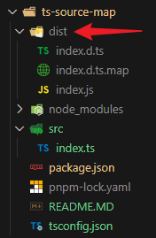
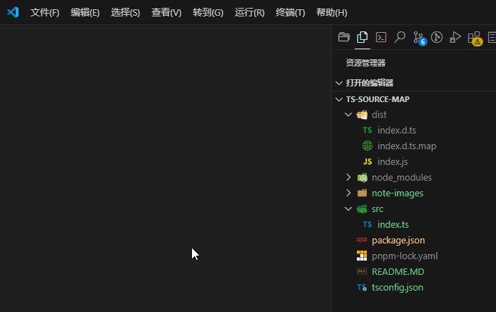

# 笔记

`./tsconfig.json`

```json
{
  "compilerOptions": {
    "outDir": "./dist",
    "declaration": true,
    "declarationMap": true
  },
  "include": ["src/**/*.ts"]
}
```

`./package.json`

```jsonc
{
  "name": "ts-source-map",
  "version": "1.0.0",
  "description": "typescript source map practice",
  "main": "index.js",
  "scripts": {
    // 关键是这一句，不要写 tsc ./src/index.ts。只写 tsc 即可
    "build": "tsc"
  },
  "keywords": [],
  "author": "",
  "license": "ISC",
  "dependencies": {
    "typescript": "^5.7.2"
  }
}
```

`./src/index.ts`

```ts
interface Person {
  name: string;
  age: number;
}

const person: Person = {
  name: 'Tom',
  age: 25
}
```

运行命令

```bash
pnpm build
```



编译产物如下：

`./dist/index.js`

```js
var person = {
    name: 'Tom',
    age: 25
};
```

`./dist/index.d.ts`

```ts
interface Person {
    name: string;
    age: number;
}
declare const person: Person;
//# sourceMappingURL=index.d.ts.map
```

`./dist/index.d.ts.map`

```json
{
  "version": 3,
  "file": "index.d.ts",
  "sourceRoot": "",
  "sources": [
    "../src/index.ts"
  ],
  "names": [],
  "mappings": "AAAA,UAAU,MAAM;IACd,IAAI,EAAE,MAAM,CAAC;IACb,GAAG,EAAE,MAAM,CAAC;CACb;AAED,QAAA,MAAM,MAAM,EAAE,MAGb,CAAA"
}
```



`./dist/index.d.ts.map` 的作用是：**把 `./dist/index.d.ts` 映射到 `./src/index.ts`**
